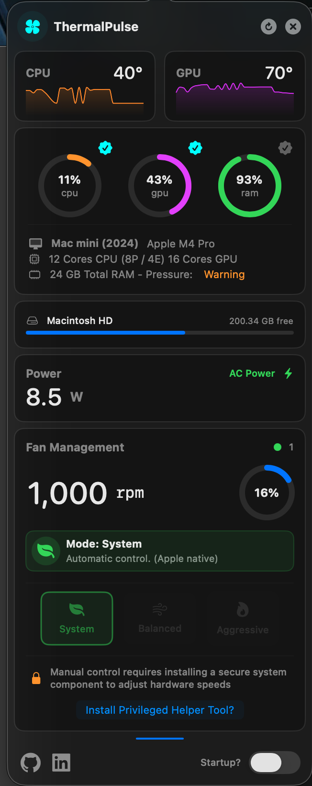
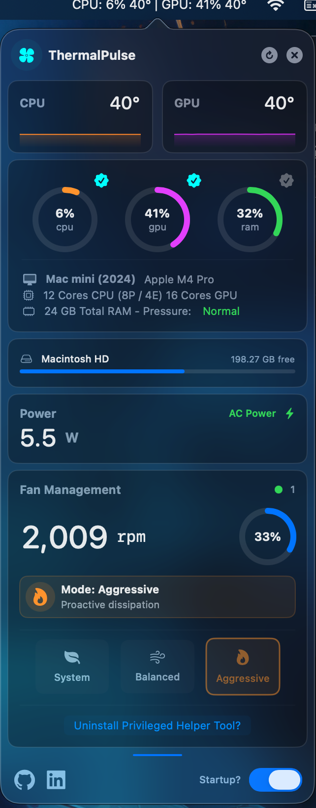
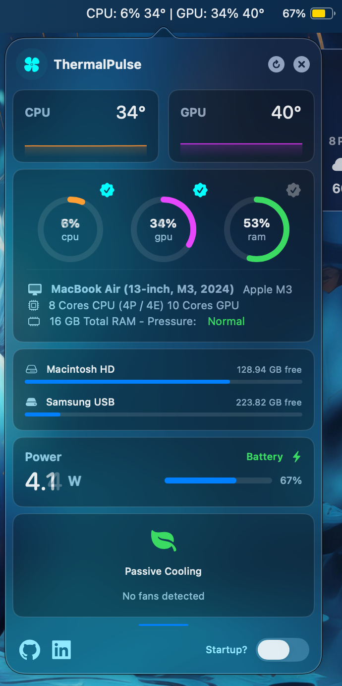

# ThermalPulse

ThermalPulse is a fully-functional, modern, lightweight, SwiftUI macOS application for hardware monitoring and fan control. Built with **SwiftUI**, it offers a premium glassmorphic interface to monitor your computer.

New update: The code was cleaned up and significant optimizations in resource consumption were achieved.

Download latest version: 1.1 https://github.com/arnabau/thermalpulse/releases/latest

## 🚀 Key Features

- **Safe-by-design**
- Real-time CPU/GPU temperature tracking
- CPU/GPU/RAM usage visualization
- Disk space monitoring with progress bars
- Power consumption metrics
- Automatic fan mode (default)
- Manual profile modes (System, Balanced, Aggressive)
- **Privileged helper tool** installation for manual control
- Smooth fan speed adjustment with XPC communication
- Menu Bar Integration
- Customizable menu bar icons showing selected metrics
- Real-time updates with throttling
- Popover dashboard with full monitoring interface
- Launch at login functionality
- Proper app termination handling (returning fans to auto mode)
- macOS 13+ compatibility with Charts framework
- **Localization**: Implements localization. (ToDo)

## 🏗 Architecture & Technology

ThermalPulse follows the **MVVM (Model-View-ViewModel)** architectural pattern, ensuring a clean (architecture) separation of concerns:

- **ViewModel layer** (DashboardViewModel) managing state and business logic
- **Manager layer** (HardwareMonitorManager) handling hardware monitoring
- **Service layer** (HelperInstaller, XPCClient) for privileged operations
- **UI layer** (DashboardView, MenuBarController) for presentation

### Technical Highlights:
- Secure communication with privileged helper tool
- Manual fan mode control
- Speed adjustment capabilities
- Memory Management
- Proper cleanup of XPC connections
- ARC handling for long-lived objects
- Cancellable subscriptions
- Custom VisualEffectView for glassmorphism
- Animated refresh button
- Responsive dashboard layout
- Interactive charts and graphs
- Reactive updates through Combine publishers
- UserDefaults persistence
- Thread-safe operations with @MainActor

### The app implements a secure approach by:
- Requiring explicit user consent for helper tool installation
- Using macOS's ServiceManagement framework
- Proper XPC communication for privileged operations
- Cleanup on app termination

## Requirements
- macOS 26 or later
- Apple Silicon (M1, M2, M3, M4, M5). No Intel support

## 📸 Interface

| Dashboard | Mac Mini | Macbook Air |
| :---: | :---: | :---: |
|  |  |  |

The UI leverages **Glassmorphism** and **Material effects** to blend perfectly with the macOS aesthetic.

## ToDo:
- Error Handling: More robust error messaging for failed installations
- ~~Performance: Additional throttling for high-frequency updates~~
- Localization: Internationalization support

## 🛠 Installation
1. Download the binary (dmg), drag it to Applications folder, launch the app and click "Install Helper" if you want to take control of the fans
2. Clone the repository:
   ```bash
   git clone [https://github.com/arnabau/ThermalPulse.git](https://github.com/arnabau/ThermalPulse.git)

### Tip:
To modify the fan speeds on your Mac, ThermalPulse needs to install a helper tool to communicate directly with the Apple hardware and access the System Management Controller (SMC). The application's Dashboard provides the option to install and uninstall the helper tool as needed.

Most of the time you'll only use "System" mode. Apple knows how to balance its own temperatures quite well, although they prefer a quiet environment even if it means more heat.

ThermalPulse "Balanced" and "Aggressive" modes work with a simple but effective algorithm. They try to maintain a balance between heat and noise. If you really need to get the most out of your Mac and prefer a cooler environment, try using these manual modes. 

Thank you for using ThermalPulse. I developed it with a lot of love and effort.

Your suggestions or bug reports are welcome. You're also welcome to collaborate on the project.
